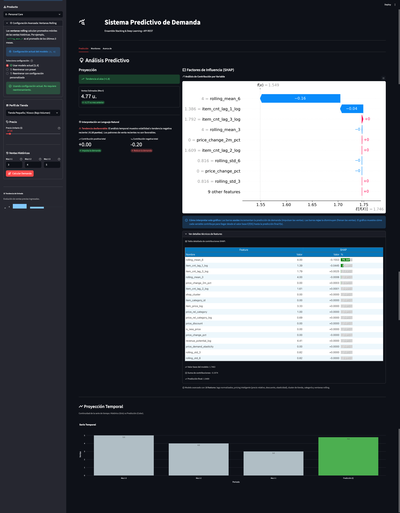
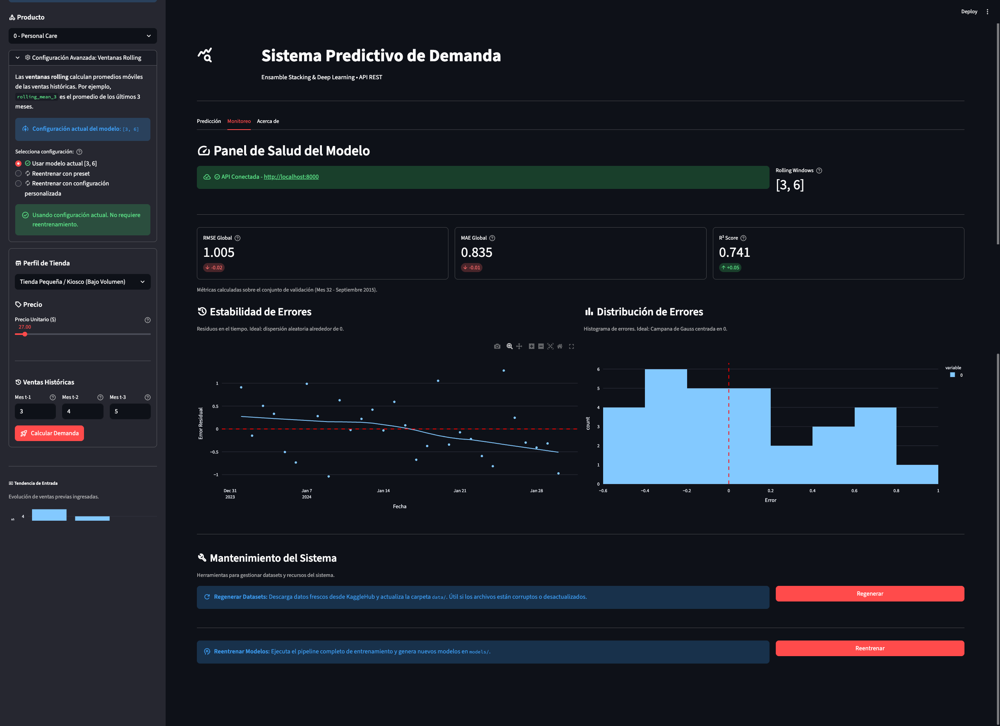

# Predicción de Demanda en E-commerce - Equipo 9 (ACIF104)

Este repositorio contiene el proyecto final para la asignatura **Aprendizaje de Máquinas (ACIF104)** de la Universidad Andrés Bello. El objetivo es desarrollar un sistema robusto de predicción de demanda para retail utilizando una arquitectura de **Ensemble Learning (Stacking)**, enriquecida con **Clustering Particional (K-Means)** y desplegada mediante una aplicación web interactiva con **Streamlit**.

## Integrantes del Equipo

* **Esteban Garviso**
* **Felipe Ortega**

## Estructura del Proyecto

El proyecto sigue una arquitectura modular que desacopla la lógica de negocio (Backend) de la capa de presentación (Frontend), facilitando la mantenibilidad y escalabilidad:

```text
acif104_s9_equipo9/
│
├── README.md               # Documentación y manual de ejecución
├── Pipfile                 # Definición de dependencias y scripts
├── Pipfile.lock            # Árbol de dependencias exacto (reproducibilidad)
├── pyproject.toml          # Configuración centralizada de QA (Black, Isort, Mypy)
│
├── data/                   # Datasets con sistema de respaldo automático
│   ├── .gitkeep            # Los datos se descargan automáticamente vía KaggleHub
│   └── [*.csv]             # Respaldo local: sales_train, items, shops, item_categories
│
├── notebooks/              # Prototipado y análisis exploratorio
│   ├── 01_EDA_Clustering.ipynb      # K-Means, Outliers y patrones temporales
│   └── 02_Modelado_Ensemble.ipynb   # Experimentos con Stacking y comparativas
│
├── src/                    # Backend: Lógica de Negocio y Modelado
│   ├── __init__.py         # Inicialización del paquete
│   ├── data_processing.py  # Pipeline ETL: Limpieza, Clustering, Features, Respaldo
│   ├── train.py            # Script de entrenamiento, validación y serialización
│   └── inference.py        # Motor de inferencia con sistema de respaldo
│
├── app/                    # Frontend: Interfaz de Usuario con Streamlit (Arquitectura SOLID)
│   ├── README.md           # Documentación de arquitectura modular
│   ├── app.py              # Punto de entrada principal
│   ├── config.py           # Configuraciones centralizadas
│   ├── state_manager.py    # Gestión de estado (Singleton)
│   │
│   ├── services/           # Lógica de negocio
│   │   ├── pricing_service.py       # Precios dinámicos por categoría
│   │   ├── prediction_service.py    # Predicciones ML + SHAP
│   │   └── trend_analyzer.py        # Análisis de tendencias
│   │
│   ├── components/         # Componentes de visualización
│   │   ├── chart_builder.py         # Gráficos Plotly reutilizables
│   │   ├── shap_renderer.py         # Renderizado SHAP (dark/light theme)
│   │   └── dataframe_builder.py     # Construcción de DataFrames
│   │
│   ├── views/              # Vistas principales
│   │   ├── prediction_view.py       # Análisis predictivo con KPIs y SHAP
│   │   ├── monitoring_view.py       # Salud del modelo + Mantenimiento
│   │   └── architecture_view.py     # Documentación técnica
│   │
│   └── ui_components/      # Componentes de UI
│       ├── sidebar.py               # Controles laterales y formularios
│       └── header.py                # Encabezado de la aplicación
│
└── models/                 # Artefactos serializados (Persistencia)
    ├── stacking_model.pkl  # Modelo final de ensamble (RF + XGBoost)
    ├── features.pkl        # Metadatos de columnas
    ├── xgb_simple_shap.pkl # Modelo proxy para explicabilidad
    └── category_prices.pkl # Precios promedio por categoría
```

## Instalación y Configuración

Este proyecto utiliza **Pipenv** para asegurar un entorno determinista y **KaggleHub** para la gestión automática del dataset con sistema de respaldo local.

### 1. Prerrequisitos

* **Python:** Versión 3.10 (Requerido)
* **Gestor de Paquetes:** `pipenv` instalado globalmente

  ```bash
  pip install pipenv
  ```

### 2. Clonar el Repositorio

```bash
git clone https://github.com/estebangarviso/acif104_s9_equipo9.git
cd acif104_s9_equipo9
```

### 3. Instalar Dependencias

Para replicar el entorno exacto definido en el `Pipfile.lock`:

```bash
pipenv install --ignore-pipfile
```

*(Para desarrollo y herramientas de QA: `pipenv install --dev`)*

## Manual de Comandos (Scripts)

Hemos configurado scripts automatizados en Pipenv para agilizar el ciclo de vida del desarrollo. Ejecuta estos comandos en la terminal:

### Ejecución Principal

| Comando                | Descripción                                                                                                                                                                                                              |
| :--------------------- | :----------------------------------------------------------------------------------------------------------------------------------------------------------------------------------------------------------------------- |
| **`pipenv run start`** | **Inicia la Aplicación Web (Frontend + Backend).** Despliega la interfaz en Streamlit para interactuar con el modelo y ver la explicabilidad SHAP. *URL por defecto: [http://localhost:8501](http://localhost:8501)*     |
| **`pipenv run train`** | **Ejecuta el Pipeline de Entrenamiento.** 1. Descarga/carga datos (KaggleHub + respaldo local). 2. Aplica Clustering K-Means y Feature Engineering. 3. Entrena el Stacking Ensemble. 4. Guarda los modelos en `/models`. |

### Calidad de Código (QA)

| Comando                    | Descripción                                                                   |
| :------------------------- | :---------------------------------------------------------------------------- |
| **`pipenv run check-all`** | **Suite Completa.** Ejecuta formato, linting y chequeo de tipos en secuencia. |
| `pipenv run format`        | Aplica formato automático con **Black** e **Isort**.                          |
| `pipenv run lint`          | Analiza el código estáticamente con **Pylint**.                               |
| `pipenv run type-check`    | Valida tipos estáticos con **Mypy**.                                          |

## Características Principales

### Sistema de Respaldo de Datos

Implementación robusta de gestión de datasets con múltiples capas de seguridad:

1. **Prioridad de carga:**
   * ✅ Si `data/` tiene todos los archivos → los usa directamente (más rápido)
   * ⏳ Si no → descarga desde KaggleHub
   * 💾 Copia automáticamente a `data/` como respaldo
   * ⚠️ Si KaggleHub falla → usa `data/` como último recurso

2. **Validaciones automáticas:**
   * Verifica existencia de archivos requeridos
   * Valida que no estén vacíos (tamaño > 0)
   * Comprueba que los DataFrames cargados contengan datos

3. **Archivos gestionados:**
   * `sales_train.csv` - Registros históricos de ventas
   * `items.csv` - Catálogo de productos
   * `shops.csv` - Información de tiendas
   * `item_categories.csv` - Categorías de productos

### Panel de Mantenimiento (UI)

La aplicación incluye una sección de mantenimiento en la pestaña **Monitoreo** con funcionalidades avanzadas:

#### **Regenerar Datasets**

* Botón para forzar descarga fresca desde KaggleHub
* Actualiza automáticamente la carpeta `data/`
* Útil si los archivos están corruptos o desactualizados
* Mensajes de estado persistentes (éxito/error)

#### **Reentrenar Modelos**

* Botón para ejecutar el pipeline completo de entrenamiento desde la UI
* Genera nuevos modelos: `stacking_model.pkl`, `xgb_simple_shap.pkl`, `category_prices.pkl`
* Limpia automáticamente el caché de Streamlit
* Carga los nuevos modelos sin necesidad de reiniciar la aplicación
* Incluye spinner con feedback durante el proceso (puede tomar varios minutos)

### Interfaz de Usuario

* **Predicción de Demanda**: Formulario interactivo con KPIs en tiempo real
* **Explicabilidad SHAP**: Visualización de factores de influencia con soporte para tema dark/light
* **Precios Dinámicos**: Slider que se ajusta automáticamente según la categoría (±200% del promedio)
* **Gráficos Interactivos**: Proyecciones temporales con Plotly
* **Panel de Salud**: Métricas del modelo (RMSE, MAE, R²) y gráficos de estabilidad

## Capturas de Pantalla

### Vista de Predicción

La interfaz principal permite realizar predicciones interactivas con visualización de factores de influencia SHAP:



### Panel de Monitoreo

Métricas de rendimiento del modelo y herramientas de mantenimiento del sistema:



## Descripción Técnica del Sistema

### 1. Metodología

El proyecto se rige por la metodología **CRISP-DM**, abarcando desde la comprensión del negocio y datos hasta el despliegue del prototipo funcional.

### 2. Arquitectura del Modelo (Stacking)

Implementamos una estrategia de **Ensemble Learning Heterogéneo** para reducir la varianza y el sesgo:

* **Nivel Base (Weak Learners):**
  * *Random Forest:* Captura no-linealidades robustas mediante agregación de árboles (n_estimators=50, max_depth=10)
  * *XGBoost:* Optimiza el error residual mediante Gradient Boosting (n_estimators=100, learning_rate=0.1)
* **Meta-Modelo (Nivel 1):**
  * *Regresión Lineal:* Pondera las predicciones base para generar la estimación final

### 3. Aprendizaje No Supervisado

**Clustering Particional (K-Means):**

* Segmentación automática de tiendas según volumen de venta histórico
* k=2 clusters determinados por el método del codo
* Feature adicional: `shop_cluster` (0: Bajo Volumen, 1: Volumen Medio, 2: Alto Volumen)
* Implementado en `src/data_processing.py::generate_clusters()`

### 4. Ingeniería de Características

* **Variables Temporales (Lags):** Rezagos (t-1, t-2, t-3) para capturar la inercia de la demanda
* **Balanceo de Target:** Transformación `log1p` en la variable objetivo para normalizar la distribución de ventas
* **Clipping de Outliers:** Limitación de valores extremos en ventas (0-20) y precios (0-300,000)
* **Agregación Temporal:** Ventas mensuales con precio promedio por mes

### 5. Explicabilidad (XAI)

El sistema integra **SHAP (SHapley Additive exPlanations)** en el frontend, proporcionando transparencia algorítmica al desglosar el impacto marginal de cada variable en la predicción final.

* **Modelo Proxy:** XGBoost simplificado para compatibilidad con TreeExplainer
* **Visualización Dinámica:** Waterfall charts con soporte para temas dark/light
* **Interpretabilidad:** Muestra cómo cada feature contribuye a la predicción

### 6. Arquitectura de Software

El frontend sigue los principios **SOLID** con una arquitectura modular:

* **18 archivos Python** con una clase por archivo
* **Separación de responsabilidades:** Services (lógica de negocio), Components (visualización), Views (vistas), UI Components (interfaz)
* **Patrones de diseño:** Singleton (SessionStateManager), Builder (ChartBuilder), Service Layer, Dependency Injection
* Para más detalles, ver [Documentación de Arquitectura](app/README.md)

## Métricas de Rendimiento

**Resultados en conjunto de validación (Mes 33):**

* **RMSE:** 1.005
* **MAE:** 0.835
* **R² Score:** 0.741

*Estos valores representan el rendimiento del Stacking Ensemble en escala logarítmica transformada.*

## Documentación Adicional

* [**Arquitectura de Aplicación (SOLID)**](app/README.md)
* [**Documentación de Arquitectura Resumida**](APP_ARCHITECTURE.md)

## Tecnologías Utilizadas

**Machine Learning:**

* scikit-learn 1.5.1 (Random Forest, Stacking)
* XGBoost 2.1.0 (Gradient Boosting)
* SHAP 0.46.0 (Explicabilidad)

**Frontend:**

* Streamlit 1.52.0 (Aplicación web)
* Plotly 5.23.0 (Visualizaciones interactivas)

**Data Processing:**

* pandas 2.2.2
* numpy 1.26.4
* KaggleHub 0.3.13 (Gestión de datasets)

**QA/Development:**

* Black 25.11.0 (Formateo)
* Pylint 3.3.9 (Linting)
* Mypy 1.19.0 (Type checking)
* Isort 6.1.0 (Ordenamiento de imports)

## Universidad Andrés Bello - 2025

**Asignatura:** ACIF104 - Aprendizaje de Máquinas  
**Docente:** [Nombre del docente]  
**Periodo:** Sexto Trimestre 2025
